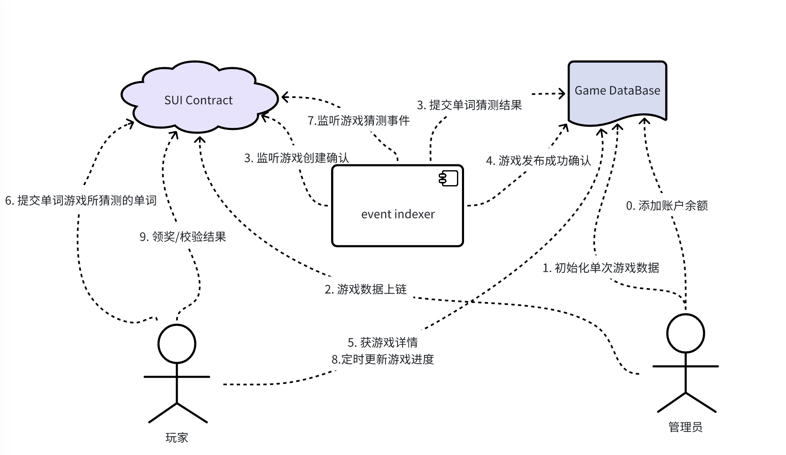
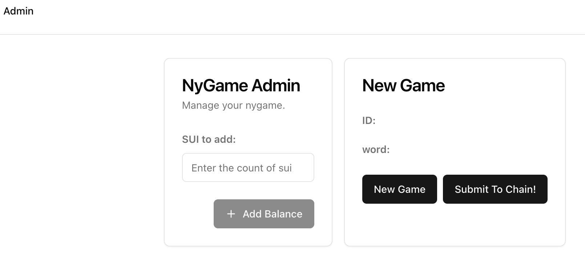
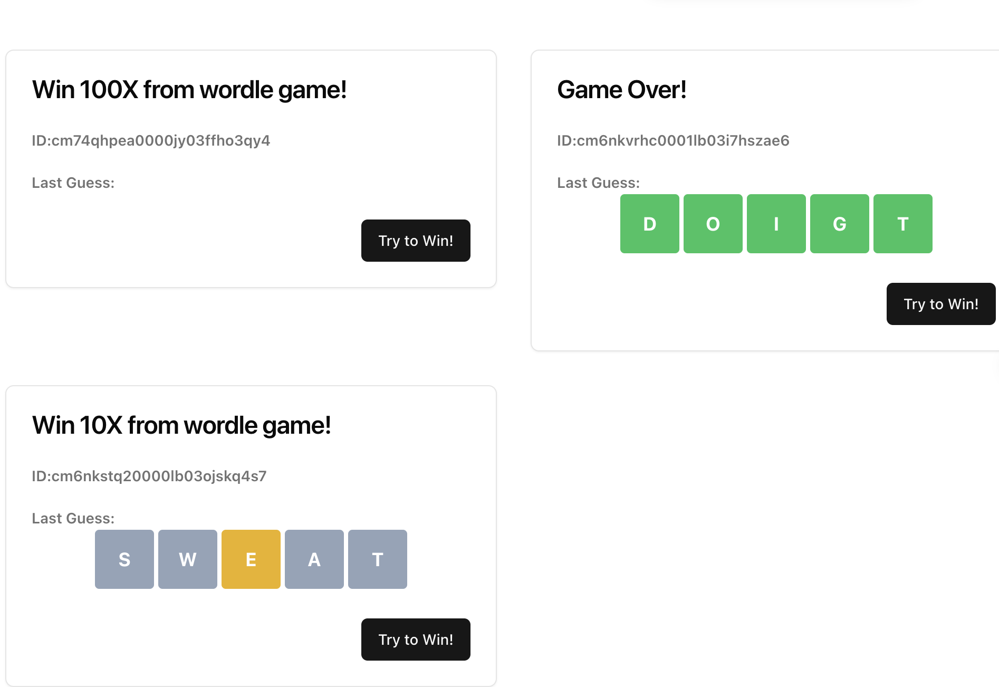
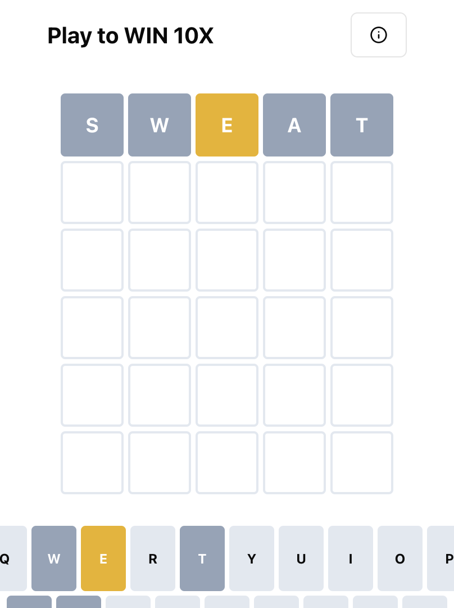
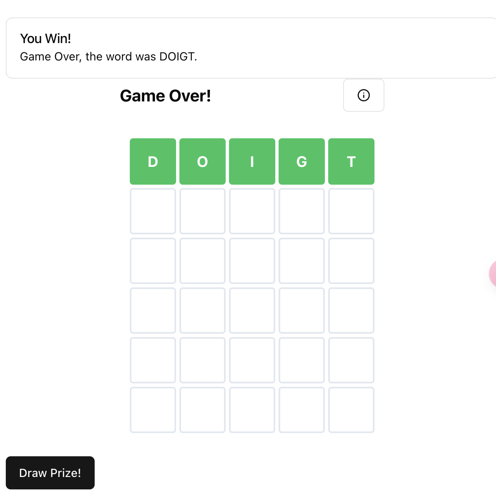

Wordle猜单词游戏，在不同步骤投注不同金额进行游戏，猜对单词可以赢得1SUI，至高获利100倍。

## 项目
### 项目地址
这是游戏的前端/后台项目。

合约项目：[sui-nygame](https://github.com/hwwang2/sui-nygame)

在线地址： [play to win 100x](https://hoh-hackathon.vercel.app/wordle)

### 项目所用技术/框架
* react/nextjs
* typescript
* tailwindcss/shadcn ui
* @mysten/dapp-kit
* prisma
* 脚手架 nextjs-sui-dapp-template

## 游戏
### 游戏流程

```txt
1. 管理员可以在后台初始化游戏，提交游戏数据（包括id、签名等）到SUI链上，游戏结果及nonce存在游戏服务器。
2. 玩家猜单词的时候，会扣除所需sui（0.01～0.8不等），并把单词提交到链上
3. 后台有event-indexer，把猜测单词等数据更新到游戏数据库中
4. 如果玩家猜对单词，可以获得1SUI的奖励，游戏结束；6次都不对游戏也结束。游戏结束后，私密数据公开，winner可以领奖，其他玩家如果有疑问可以进行验证
```

### 项目截图
* 游戏管理

* 游戏列表

* 游戏详情

* 游戏详情2-可领奖

